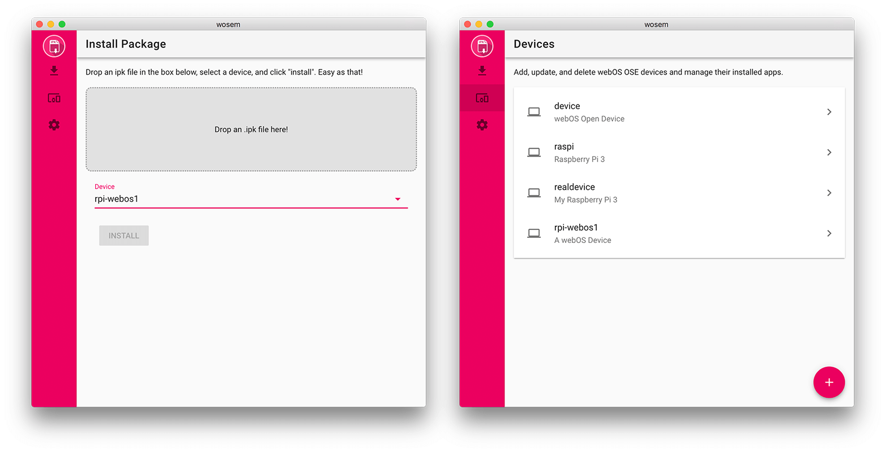

# WebOS OSE Manager

## Introduction
Back in the old days of Palm's webOS, we had a great tool called [WebOS Quick Install](https://github.com/JayCanuck/webos-quick-install) that we used to manage our devices. If you're reading this, I'd bet you're already familiar with it and may have even used it in the past. The goal of this project is to provide that same functionality (and more!), but for your webOS OSE devices.

#### What can it do?
* Add, update, and delete devices.
* Install apps (as .ipk files) to your device.
* List a device's installed apps with the ability to delete them.

## Requirements
1. NodeJS (latest LTS or newer)
2. [Ares CLI](http://webosose.org/develop/sdk-tools/cli/)

## How to build
1. Clone this repository to your machine.
2. Run `npm install` from the command line.
3. Run `npm run build` to build for the platform you're currently using.
4. Done! You'll find the package in the newly-created `build` folder.

## How to run
1. Launch WOSEM and head over to the Settings (the gear icon in the sidebar).
2. In the 'Path to Ares' field, enter the absolute path to the downloaded Ares CLI tool linked above. Remember the trailing `/` after the path.
  * macOS: /absolute/path/to/ares-cli/bin/
  * Linux (not tested): /absolute/path/to/ares-cli/bin/
  * Windows: /absolute/path/to/ares-cli/node_modules/ares-webos-sdk/bin/
3. Everything should be working now. 👍

---

WebOS OSE Manager is built with [Vue.js](https://vuejs.org/) and [Electron](https://electronjs.org/).
